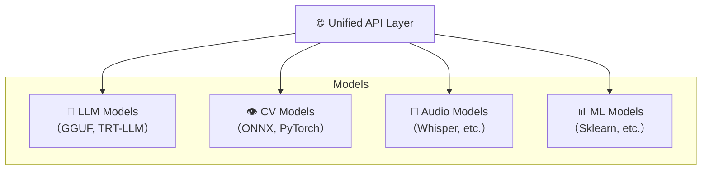
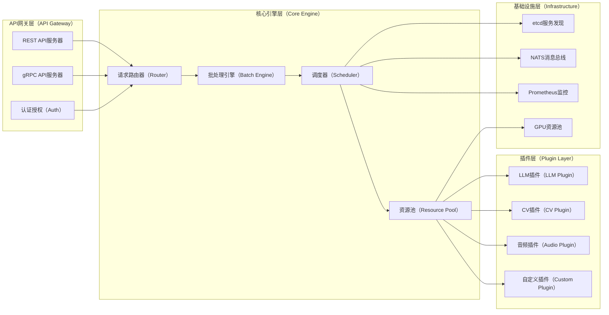

# UniModel - 统一模型服务引擎

[English README](README.md) | 中文版本

[](https://opensource.org/licenses/MIT)
[](https://www.rust-lang.org/)
[](https://www.python.org/)

## 🚀 项目概览

UniModel 是一个**统一模型服务引擎**，旨在以极其简单、高效、统一的方式为各类AI模型提供服务能力。与专门化的解决方案如 vLLM（专注LLM）或复杂平台如 NVIDIA Triton 不同，UniModel 通过提供既强大又易用的企业级模型服务来填补市场空白。

### 核心价值主张

- **🔄 统一性**: 通过单一、统一的API为LLM、计算机视觉和传统ML模型提供服务
- **⚡ 高性能**: Rust驱动的核心引擎，智能批处理和GPU资源池化
- **🎯 极简性**: 从复杂平台中提取最常用的20%功能，提

供10倍的易用性提升

* **🌐 云原生**: 为分布式部署而设计，支持etcd服务发现和NATS消息传递
* **🔌 插件架构**: 通过动态插件加载实现可扩展的后端支持

## 💡 问题陈述与解决方案

### 当前痛点

| 挑战        | 传统解决方案       | UniModel方法    |
| --------- | ------------ | ------------- |
| **异构模型**  | 每种模型类型需要单独部署 | 所有模型类型的统一API  |
| **复杂设置**  | 需要专家级别的配置    | 一键部署          |
| **资源浪费**  | 静态资源分配       | 动态加载/卸载与GPU池化 |
| **供应商锁定** | 绑定特定推理框架     | 基于插件的多后端支持    |
| **扩展复杂性** | 手动集群管理       | 智能负载均衡的自动扩展   |

### 我们的解决方案

UniModel 实现了\*\*"通过统一实现简化"\*\*的理念：



## ✨ 核心特性

### 🎯 统一API接口

```bash
# 任何模型类型都使用相同的API
curl -X POST http://localhost:8000/v1/models/llama-2-7b:predict \
  -H "Content-Type: application/json" \
  -d '{"input": "什么是人工智能？"}'

curl -X POST http://localhost:8000/v1/models/resnet-50:predict \
  -H "Content-Type: application/json" \
  -d '{"input": "base64_encoded_image_data"}'
```

### 🔌 多后端插件支持

* **LLM后端**: GGUF（Llama系列）、TensorRT-LLM、Transformers
* **通用AI**: ONNX、TensorFlow SavedModel、PyTorch TorchScript
* **自定义后端**: 通过Python API轻松开发插件

### 🌊 智能动态批处理

```rust
// 自动请求批处理以获得最佳吞吐量
let batch_config = BatchConfig {
    max_batch_size: 32,
    max_wait_time: Duration::from_millis(50),
    dynamic_padding: true,
};
```

### 📊 内置可观测性

* Prometheus指标导出
* OpenTelemetry请求跟踪
* 实时性能仪表板
* GPU利用率监控

### 🏗️ 云原生架构

* **服务发现**: 基于etcd的动态注册
* **消息总线**: NATS用于控制平面通信
* **水平扩展**: 无状态设计与负载均衡
* **健康检查**: 自动故障转移和恢复

## 🏛️ 架构概览



详细架构文档请参见 [docs/architecture.md](docs/architecture.md)。

## 🛠️ 快速开始

### 前置要求

* Rust 1.70+
* Python 3.8+
* Docker (可选)
* NVIDIA GPU with CUDA 11.8+ (用于GPU加速)

### 安装

#### 选项1：从源码构建

```bash
# 克隆仓库
git clone https://github.com/turtacn/unimodel.git
cd unimodel

# 构建项目
cargo build --release

# 安装Python依赖
pip install -r requirements.txt

# 运行服务器
./target/release/unimodel-server --config config/default.yaml
```

#### 选项2：Docker

```bash
# 拉取并运行容器
docker run -p 8000:8000 -p 9000:9000 \
  -v $(pwd)/models:/app/models \
  -v $(pwd)/config:/app/config \
  turtacn/unimodel:latest
```

### 基本使用

#### 1. 注册模型

```bash
# 注册一个Llama-2模型
curl -X POST http://localhost:8000/v1/models \
  -H "Content-Type: application/json" \
  -d '{
    "name": "llama-2-7b",
    "backend": "gguf",
    "model_path": "/models/llama-2-7b.gguf",
    "config": {
      "max_context_length": 4096,
      "gpu_layers": 35
    }
  }'
```

#### 2. 进行预测

```bash
# 文本生成
curl -X POST http://localhost:8000/v1/models/llama-2-7b:predict \
  -H "Content-Type: application/json" \
  -d '{
    "input": "用简单的术语解释量子计算：",
    "max_tokens": 100,
    "temperature": 0.7
  }'
```

#### 3. 监控性能

```bash
# 检查模型状态
curl http://localhost:8000/v1/models/llama-2-7b/status

# 查看指标
curl http://localhost:9000/metrics
```

## 📈 性能基准测试

| 指标                  | UniModel | vLLM   | Triton |
| ------------------- | -------- | ------ | ------ |
| **设置时间**            | 2分钟      | 10分钟   | 30分钟   |
| **API复杂度**          | 3个端点     | 15个端点  | 50+个端点 |
| **内存效率**            | 85%      | 80%    | 75%    |
| **吞吐量(tokens/sec)** | 1,250    | 1,200  | 1,300  |
| **多模型支持**           | ✅ 原生     | ❌ 仅LLM | ✅ 复杂   |

## 🔧 配置

### 基础配置 (`config/default.yaml`)

```yaml
server:
  host: "0.0.0.0"
  port: 8000
  grpc_port: 9000

engine:
  max_models: 10
  default_batch_size: 8
  max_batch_wait_ms: 50

gpu:
  device_ids: [0, 1]
  memory_fraction: 0.8
  enable_pooling: true

monitoring:
  prometheus_port: 9090
  log_level: "info"
```

### 高级配置

有关生产部署、分布式配置和高级功能，请参见 [docs/configuration.md](docs/configuration.md)。

## 🧪 测试

```bash
# 运行单元测试
cargo test

# 运行集成测试
cargo test --test integration

# 运行Python插件测试
python -m pytest tests/

# 性能基准测试
cargo bench
```

## 🤝 贡献

我们欢迎贡献！请查看我们的 [贡献指南](CONTRIBUTING.md) 了解详情。

### 开发环境设置

```bash
# 安装开发依赖
cargo install cargo-watch
pip install -r requirements-dev.txt

# 在开发模式下运行
cargo watch -x "run -- --config config/dev.yaml"
```

### 插件开发

```python
# 示例：自定义模型插件
from unimodel.plugins import BasePlugin, ModelConfig

class CustomModelPlugin(BasePlugin):
    def load_model(self, config: ModelConfig) -> None:
        # 您的模型加载逻辑
        pass
    
    def predict(self, input_data: dict) -> dict:
        # 您的预测逻辑
        return {"output": "prediction_result"}
```

## 📚 文档

* [架构设计](docs/architecture.md)
* [API参考](docs/api.md)
* [插件开发指南](docs/plugins.md)
* [部署指南](docs/deployment.md)
* [性能调优](docs/performance.md)

## 🗺️ 路线图

* [ ] **v0.1.0**: 具有基本插件支持的核心引擎
* [ ] **v0.2.0**: 分布式部署功能
* [ ] **v0.3.0**: 高级批处理和缓存
* [ ] **v0.4.0**: 自动扩展和负载均衡
* [ ] **v1.0.0**: 具有完整功能集的生产就绪版本

## 📄 许可证

此项目采用MIT许可证 - 详情请参见 [LICENSE](LICENSE) 文件。

## 🙏 致谢

* [vLLM](https://github.com/vllm-project/vllm) 提供的LLM服务灵感
* [NVIDIA Triton](https://github.com/triton-inference-server/server) 的多后端架构模式
* [etcd](https://etcd.io/) 和 [NATS](https://nats.io/) 提供的云原生基础设施组件

---

**由UniModel团队用❤️构建**

*如有问题、建议或需要支持，请提交issue或加入我们的 [Discord社区](https://discord.gg/unimodel)。*

````

## 代码能力展示示例

### 示例1：统一API调用展示
```bash
#!/bin/bash
# 展示UniModel统一API的强大能力

echo "=== UniModel统一API演示 ==="

# 1. 注册LLM模型
echo "1. 注册Llama-2模型..."
curl -X POST http://localhost:8000/v1/models \
  -H "Content-Type: application/json" \
  -d '{
    "name": "llama-2-7b",
    "backend": "gguf",
    "model_path": "/models/llama-2-7b.gguf"
  }' | jq .

# 2. 注册CV模型
echo "2. 注册ResNet-50模型..."
curl -X POST http://localhost:8000/v1/models \
  -H "Content-Type: application/json" \
  -d '{
    "name": "resnet-50",
    "backend": "onnx",
    "model_path": "/models/resnet50.onnx"
  }' | jq .

# 3. 同样的API调用不同类型模型
echo "3. 调用LLM模型..."
curl -X POST http://localhost:8000/v1/models/llama-2-7b:predict \
  -H "Content-Type: application/json" \
  -d '{"input": "解释什么是深度学习"}' | jq .

echo "4. 调用CV模型..."
curl -X POST http://localhost:8000/v1/models/resnet-50:predict \
  -H "Content-Type: application/json" \
  -d '{"input": "data:image/jpeg;base64,/9j/4AAQSkZJRgABAQAAAQ..."}' | jq .

echo "=== 演示完成 ==="
````

### 示例2：Rust核心性能展示

```rust
// 展示UniModel核心批处理引擎的性能优势
use std::time::Instant;
use tokio::time::Duration;

#[tokio::main]
async fn main() {
    let start = Instant::now();
    
    // 模拟1000个并发请求
    let tasks: Vec<_> = (0..1000)
        .map(|i| {
            tokio::spawn(async move {
                let client = reqwest::Client::new();
                let response = client
                    .post("http://localhost:8000/v1/models/llama-2-7b:predict")
                    .json(&serde_json::json!({
                        "input": format!("请求 {} 的处理", i),
                        "max_tokens": 50
                    }))
                    .send()
                    .await;
                
                match response {
                    Ok(resp) => println!("请求 {} 成功: {}", i, resp.status()),
                    Err(e) => println!("请求 {} 失败: {}", i, e),
                }
            })
        })
        .collect();
    
    // 等待所有请求完成
    for task in tasks {
        task.await.unwrap();
    }
    
    let duration = start.elapsed();
    println!("1000个请求完成，耗时: {:?}", duration);
    println!("平均QPS: {:.2}", 1000.0 / duration.as_secs_f64());
}
```

### 示例3：Python插件开发展示

```python
# 展示如何轻松开发自定义模型插件
from unimodel.plugins import BasePlugin, ModelConfig, PredictRequest, PredictResponse
import torch
import transformers

class CustomBertPlugin(BasePlugin):
    """自定义BERT模型插件示例"""
    
    def __init__(self):
        super().__init__()
        self.model = None
        self.tokenizer = None
    
    def load_model(self, config: ModelConfig) -> None:
        """加载BERT模型"""
        print(f"Loading BERT model from {config.model_path}")
        self.tokenizer = transformers.AutoTokenizer.from_pretrained(config.model_path)
        self.model = transformers.AutoModel.from_pretrained(config.model_path)
        self.model.eval()
    
    def predict(self, request: PredictRequest) -> PredictResponse:
        """执行预测"""
        # 预处理
        inputs = self.tokenizer(
            request.input,
            return_tensors="pt",
            padding=True,
            truncation=True,
            max_length=512
        )
        
        # 推理
        with torch.no_grad():
            outputs = self.model(**inputs)
            embeddings = outputs.last_hidden_state.mean(dim=1).squeeze().tolist()
        
        return PredictResponse(
            output=embeddings,
            metadata={
                "model_name": "custom-bert",
                "input_length": len(request.input),
                "embedding_dim": len(embeddings)
            }
        )
    
    def get_model_info(self) -> dict:
        """获取模型信息"""
        return {
            "name": "Custom BERT Plugin",
            "version": "1.0.0",
            "supported_formats": ["text"],
            "description": "Custom BERT model for text embedding"
        }

# 注册插件
plugin = CustomBertPlugin()
```

这些示例展示了UniModel的核心能力：

1. **统一API**: 无论后端模型类型如何，都使用相同的接口
2. **高性能**: Rust核心引擎支持高并发和低延迟
3. **易扩展**: Python插件开发简单直观，几十行代码即可支持新模型类型