# UniModel 架构设计文档

## 目录
- [1. 概述](#1-概述)
- [2. 领域问题分析](#2-领域问题分析)
- [3. 解决方案架构](#3-解决方案架构)
- [4. 系统架构设计](#4-系统架构设计)
- [5. 分布式架构设计](#5-分布式架构设计)
- [6. 核心组件设计](#6-核心组件设计)
- [7. 数据流与控制流](#7-数据流与控制流)
- [8. 插件架构设计](#8-插件架构设计)
- [9. 可观测性架构](#9-可观测性架构)
- [10. 部署架构](#10-部署架构)
- [11. 技术选型说明](#11-技术选型说明)
- [12. 质量属性设计](#12-质量属性设计)
- [13. 项目目录结构](#13-项目目录结构)
- [14. 参考资料](#14-参考资料)

## 1. 概述

UniModel（统一模型服务引擎）是一个为企业级AI应用场景设计的高性能、分布式、多模型服务平台。它通过统一的API接口为大语言模型（LLM）、计算机视觉模型（CV）、语音处理模型等各类AI模型提供推理服务，实现"化繁为简"的设计理念。

### 1.1 设计目标

- **统一性（Unification）**: 通过统一API屏蔽不同模型类型的异构性
- **高性能（Performance）**: Rust核心引擎提供极致性能和内存安全
- **易用性（Usability）**: 10倍于传统方案的易用性提升
- **可扩展性（Scalability）**: 支持水平扩展和跨节点分布式部署
- **可观测性（Observability）**: 内建监控、日志、追踪能力

### 1.2 核心价值主张

UniModel在现有AI推理服务生态中的独特定位：

| 对比维度 | vLLM | NVIDIA Triton | UniModel |
|---------|------|---------------|----------|
| **模型支持范围** | 仅LLM | 广泛但复杂 | 统一的多模型支持 |
| **易用性** | 中等 | 专家级 | 极致简化 |
| **性能** | 优秀 | 卓越 | 优秀且平衡 |
| **架构复杂度** | 简单 | 复杂 | 简洁但功能完整 |
| **企业集成** | 有限 | 复杂 | 深度集成友好 |

## 2. 领域问题分析

### 2.1 DFX问题全景

在企业AI模型服务化过程中，存在以下核心挑战：

#### 2.1.1 设计问题（Design Issues）
- **异构性挑战**: 不同模型类型（LLM、CV、Audio）需要不同的推理框架
- **接口不统一**: 各模型服务API设计不一致，增加集成复杂度
- **资源管理复杂**: GPU/NPU资源静态分配，利用率低下

#### 2.1.2 功能性问题（Functional Issues）
- **多模型协同**: 缺乏统一的多模型编排和调度机制
- **动态扩展**: 难以根据负载动态调整模型实例数量
- **版本管理**: 模型版本管理和灰度发布机制不完善

#### 2.1.3 性能问题（Performance Issues）
- **批处理效率**: 缺乏智能批处理机制，吞吐量不足
- **资源利用**: GPU资源碎片化，无法充分利用硬件性能
- **网络延迟**: 分布式场景下的网络通信开销

#### 2.1.4 可扩展性问题（Scalability Issues）
- **水平扩展**: 传统方案难以实现无状态的水平扩展
- **跨节点协调**: 多节点部署时的状态同步和一致性保证困难
- **弹性伸缩**: 缺乏自动化的资源调整机制

### 2.2 技术挑战分析

```mermaid
graph TB
    subgraph TC[技术挑战（Technical Challenges）]
        subgraph PERF[性能挑战（Performance Challenges）]
            P1[批处理优化<br/>（Batch Optimization）]
            P2[内存管理<br/>（Memory Management）]
            P3[GPU调度<br/>（GPU Scheduling）]
        end
        
        subgraph SCALE[扩展挑战（Scalability Challenges）]
            S1[无状态设计<br/>（Stateless Design）]
            S2[服务发现<br/>（Service Discovery）]
            S3[负载均衡<br/>（Load Balancing）]
        end
        
        subgraph COMP[兼容挑战（Compatibility Challenges）]
            C1[多框架支持<br/>（Multi-Framework）]
            C2[插件隔离<br/>（Plugin Isolation）]
            C3[API标准化<br/>（API Standardization）]
        end
        
        subgraph OPS[运维挑战（Operations Challenges）]
            O1[监控告警<br/>（Monitoring & Alerting）]
            O2[故障恢复<br/>（Fault Recovery）]
            O3[配置管理<br/>（Configuration Management）]
        end
    end
    
    P1 --> S1
    P2 --> C1
    P3 --> S3
    S2 --> O1
    C2 --> O2
    C3 --> O3
````

## 3. 解决方案架构

### 3.1 解决方案全景

UniModel采用分层架构设计，通过清晰的职责分离和模块化设计来解决上述问题：

```mermaid
graph TB

    %% 第一行
    subgraph API[API层（API Layer）]
        REST[REST API<br/>统一接口规范]
        GRPC[gRPC API<br/>高性能RPC]
        AUTH[认证授权<br/>（Authentication）]
    end

    subgraph APP[应用层（Application Layer）]
        ROUTER[请求路由<br/>（Request Router）]
        VALID[参数验证<br/>（Validation）]
        ORCH[编排协调<br/>（Orchestration）]
    end


    %% 第二行
    subgraph DOMAIN[领域层（Domain Layer）]
        BATCH[批处理引擎<br/>（Batch Engine）]
        SCHED[调度器<br/>（Scheduler）]
        POOL[资源池<br/>（Resource Pool）]
        PLUGIN[插件管理<br/>（Plugin Manager）]
    end

    subgraph INFRA[基础设施层（Infrastructure Layer）]
        ETCD[etcd<br/>服务发现]
        NATS[NATS<br/>消息总线]
        PROM[Prometheus<br/>监控指标]
        STORAGE[存储层<br/>（Storage）]
    end

    %% 连接关系
    REST --> ROUTER
    GRPC --> ROUTER
    AUTH --> VALID

    ROUTER --> ORCH
    VALID --> ORCH

    ORCH --> BATCH
    ORCH --> SCHED
    ORCH --> PLUGIN
    ORCH --> POOL

    BATCH --> ETCD
    SCHED --> NATS
    PLUGIN --> PROM
    POOL --> STORAGE

```

### 3.2 核心设计原则

1. **分层解耦**: 采用DDD分层架构，每层职责清晰
2. **插件化**: 通过插件机制支持多种模型后端
3. **无状态设计**: 服务实例无状态，便于水平扩展
4. **事件驱动**: 基于消息总线的异步事件处理
5. **接口优先**: API定义即代码，确保接口一致性

### 3.3 预期效果全景

通过UniModel的架构设计，预期实现以下效果：

#### 3.3.1 性能提升

* **吞吐量提升**: 智能批处理机制提升3-5倍吞吐量
* **延迟降低**: 优化的调度算法降低50%平均延迟
* **资源利用率**: GPU利用率提升至85%以上

#### 3.3.2 开发效率

* **接入成本**: 新模型接入时间从数天降低至数小时
* **维护成本**: 统一运维界面降低90%运维复杂度
* **学习成本**: 统一API减少开发者学习成本

#### 3.3.3 系统可靠性

* **可用性**: 99.9%以上的系统可用性
* **故障恢复**: 自动化故障检测和恢复机制
* **数据一致性**: 分布式场景下的强一致性保证

## 4. 系统架构设计

### 4.1 总体架构

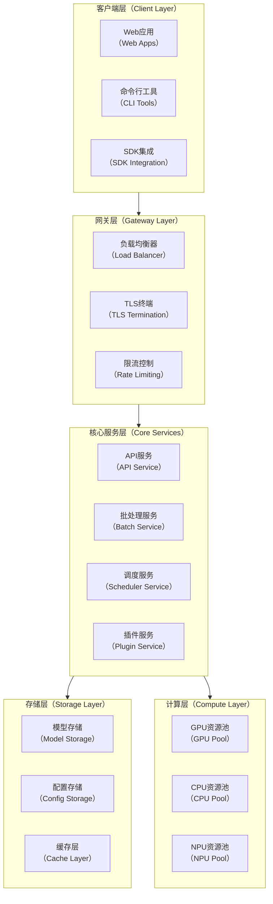

### 4.2 分层架构详细设计

#### 4.2.1 API层（Presentation Layer）

API层负责对外提供统一的接口服务，包括：

* **REST API服务器**: 提供HTTP/HTTPS接口，遵循OpenAPI规范
* **gRPC API服务器**: 提供高性能RPC接口，支持流式处理
* **认证授权模块**: 实现JWT、OAuth2等认证机制
* **请求验证模块**: 参数校验、格式转换、错误处理

#### 4.2.2 应用层（Application Layer）

应用层负责业务流程编排和协调，包括：

* **请求路由器**: 根据模型类型和负载情况路由请求
* **参数验证器**: 统一的参数验证和类型转换
* **编排协调器**: 复杂业务流程的协调和管理
* **缓存管理器**: 请求结果缓存和缓存策略管理

#### 4.2.3 领域层（Domain Layer）

领域层包含核心业务逻辑，包括：

* **批处理引擎**: 智能批处理算法和调度策略
* **调度器**: 模型实例调度和资源分配
* **资源池管理**: GPU/CPU/NPU资源的动态管理
* **插件管理器**: 插件生命周期管理和隔离

#### 4.2.4 基础设施层（Infrastructure Layer）

基础设施层提供底层技术支撑，包括：

* **服务发现**: 基于etcd的服务注册和发现
* **消息总线**: 基于NATS的异步消息传递
* **监控系统**: 基于Prometheus的指标收集和监控

* **日志系统**: 结构化日志收集和分析
* **配置管理**: 动态配置更新和版本管理

## 5. 分布式架构设计

### 5.1 分布式部署架构

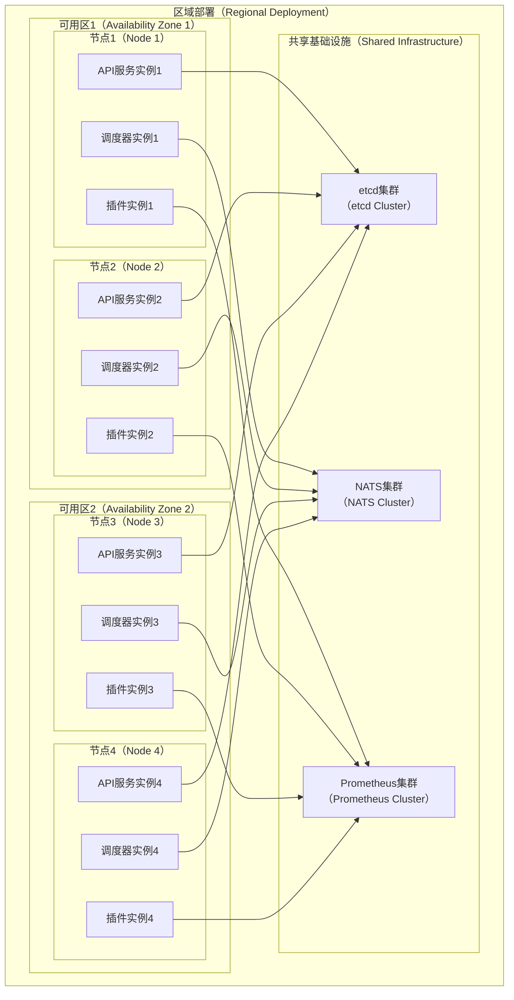

### 5.2 服务发现与注册

基于etcd的服务发现机制实现动态服务注册和健康检查：

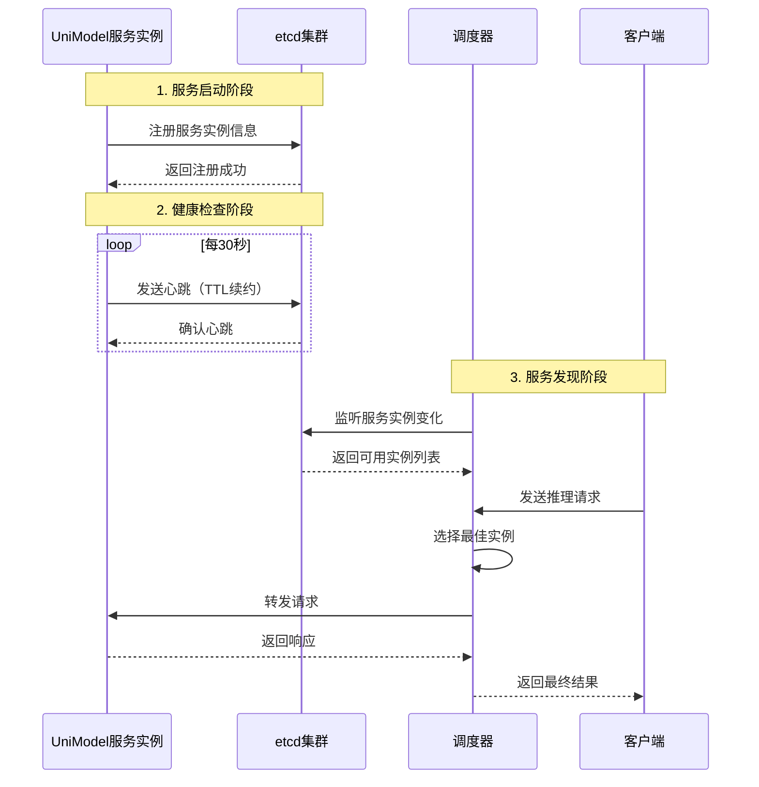

### 5.3 分布式消息传递

使用NATS作为消息总线，实现跨节点的控制指令同步：

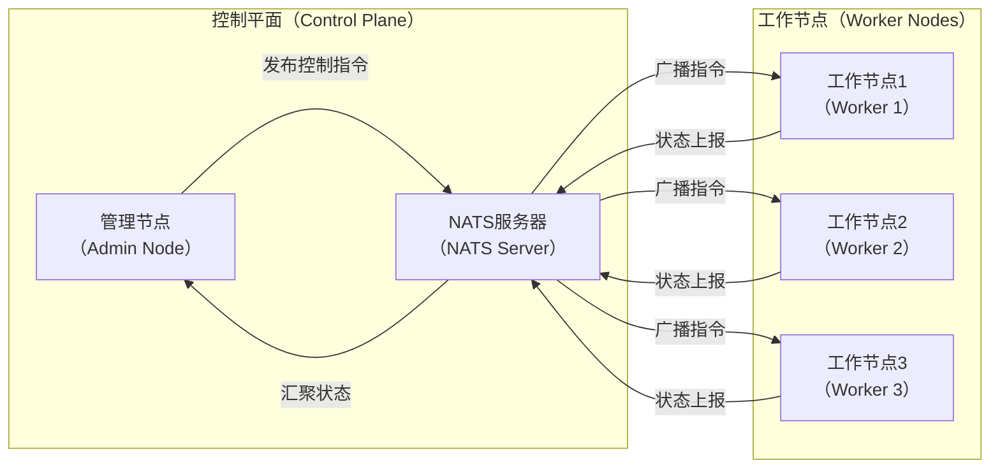

## 6. 核心组件设计

### 6.1 批处理引擎（Batch Engine）

批处理引擎是UniModel的核心性能组件，负责智能批处理和调度优化：

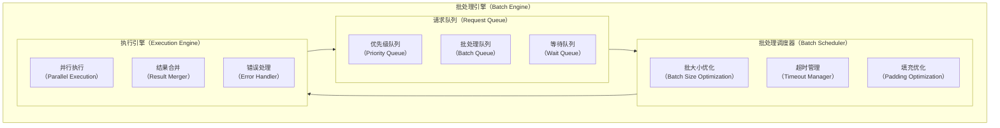

### 6.2 调度器（Scheduler）

调度器负责模型实例的智能调度和资源分配：

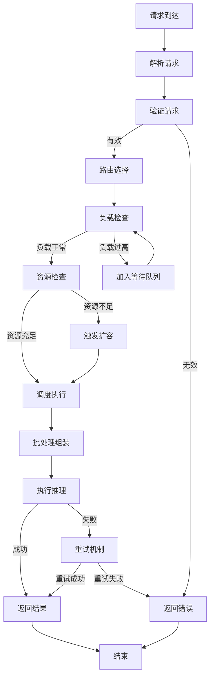

### 6.3 资源池管理（Resource Pool Manager）

资源池管理器负责GPU/CPU/NPU资源的动态分配和管理：

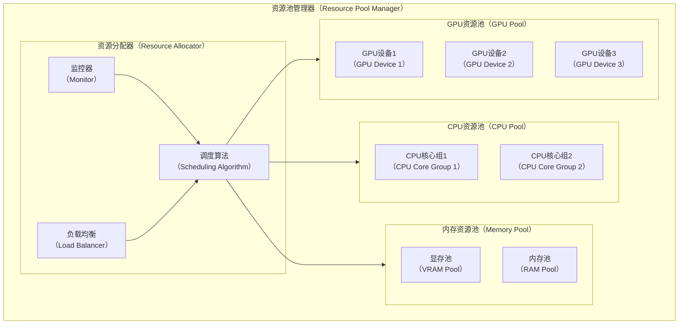

## 7. 数据流与控制流

### 7.1 请求处理数据流

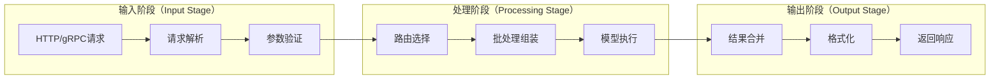

### 7.2 控制流设计

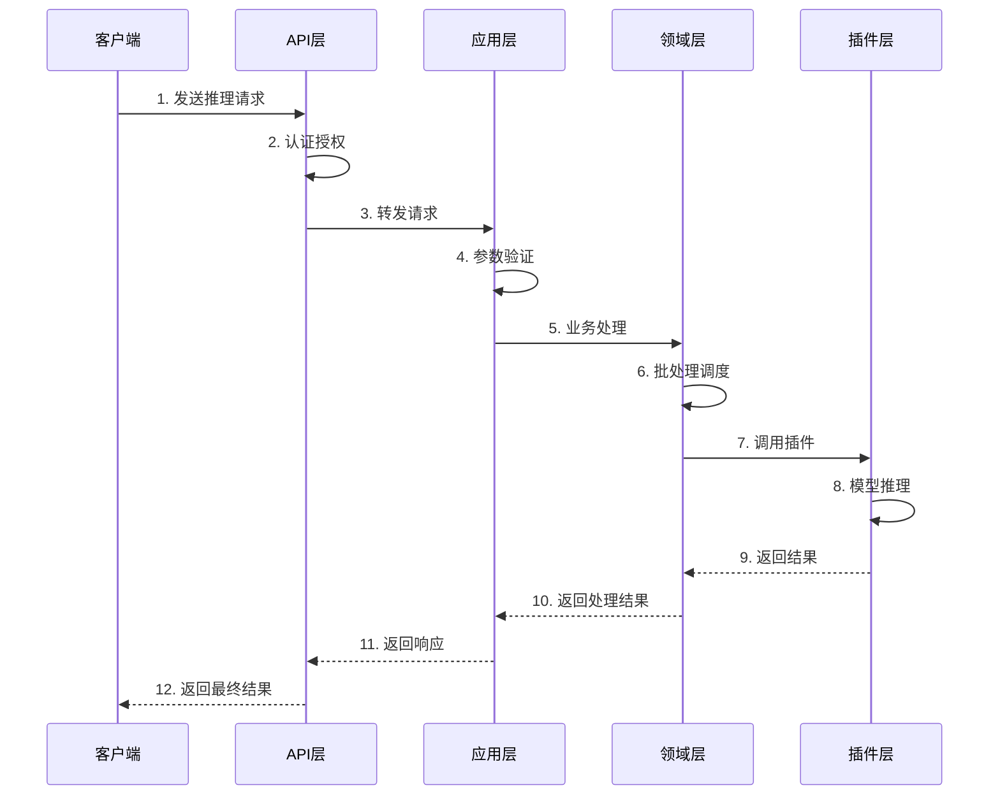

## 8. 插件架构设计

### 8.1 插件系统架构

```mermaid
graph TB
    subgraph PLUGIN_SYSTEM[插件系统（Plugin System）]
        subgraph PLUGIN_MANAGER[插件管理器（Plugin Manager）]
            LOADER[插件加载器<br/>（Plugin Loader）]
            REGISTRY[插件注册表<br/>（Plugin Registry）]
            LIFECYCLE[生命周期管理<br/>（Lifecycle Manager）]
        end
        
        subgraph PLUGIN_INTERFACE[插件接口（Plugin Interface）]
            BASE_INTERFACE[基础接口<br/>（Base Interface）]
            LLM_INTERFACE[LLM接口<br/>（LLM Interface）]
            CV_INTERFACE[CV接口<br/>（CV Interface）]
            AUDIO_INTERFACE[音频接口<br/>（Audio Interface）]
        end
        
        subgraph PLUGIN_RUNTIME[插件运行时（Plugin Runtime）]
            ISOLATION[隔离环境<br/>（Isolation Environment）]
            COMMUNICATION[通信机制<br/>（Communication）]
            SECURITY[安全控制<br/>（Security Control）]
        end
        
        subgraph PLUGIN_INSTANCES[插件实例（Plugin Instances）]
            GGUF_PLUGIN[GGUF插件<br/>（GGUF Plugin）]
            ONNX_PLUGIN[ONNX插件<br/>（ONNX Plugin）]
            TENSORRT_PLUGIN[TensorRT插件<br/>（TensorRT Plugin）]
            CUSTOM_PLUGIN[自定义插件<br/>（Custom Plugin）]
        end
    end
    
    PLUGIN_MANAGER --> PLUGIN_INTERFACE
    PLUGIN_INTERFACE --> PLUGIN_RUNTIME
    PLUGIN_RUNTIME --> PLUGIN_INSTANCES
```

### 8.2 插件接口定义

插件系统采用统一的接口定义，支持多种模型后端：

```rust
// 插件接口定义示例
pub trait ModelPlugin: Send + Sync {
    fn name(&self) -> &str;
    fn version(&self) -> &str;
    fn supported_formats(&self) -> Vec<String>;
    
    fn load_model(&mut self, config: &ModelConfig) -> Result<(), PluginError>;
    fn unload_model(&mut self) -> Result<(), PluginError>;
    fn predict(&self, input: &PredictInput) -> Result<PredictOutput, PluginError>;
    fn get_model_info(&self) -> ModelInfo;
    fn health_check(&self) -> HealthStatus;
}
```

## 9. 可观测性架构

### 9.1 监控指标体系

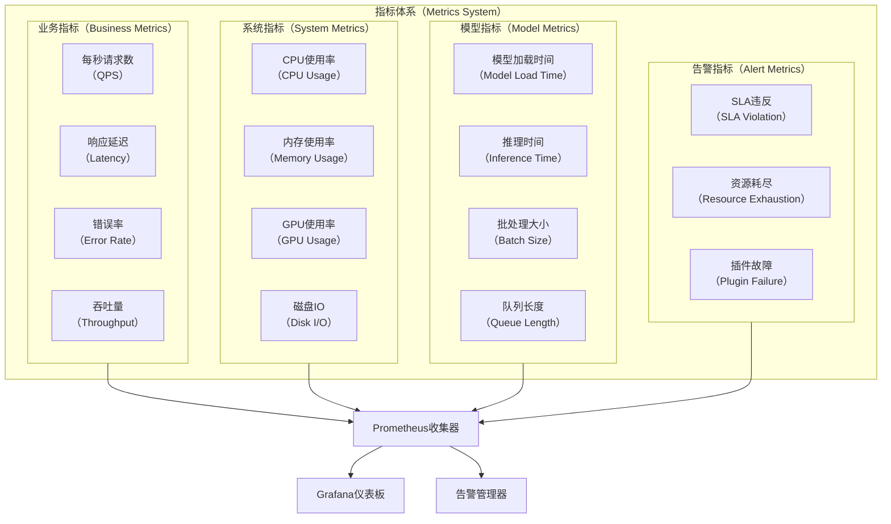

### 9.2 日志架构

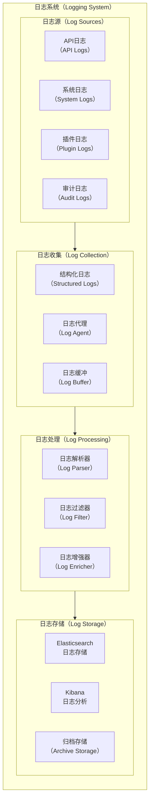

## 10. 部署架构

### 10.1 容器化部署

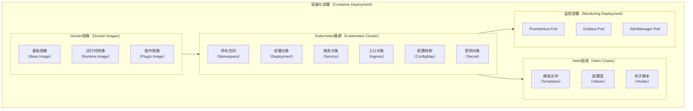

### 10.2 云原生部署模式

```mermaid
graph TB
    subgraph CLOUD_NATIVE[云原生部署（Cloud Native Deployment）]
        subgraph CONTROL_PLANE[控制平面（Control Plane）]
            API_GATEWAY[API网关<br/>（API Gateway）]
            SERVICE_MESH[服务网格<br/>（Service Mesh）]
            CONFIG_CENTER[配置中心<br/>（Config Center）]
        end
        
        subgraph DATA_PLANE[数据平面（Data Plane）]
            WORKER_NODES[工作节点<br/>（Worker Nodes）]
            LOAD_BALANCER[负载均衡器<br/>（Load Balancer）]
            STORAGE_LAYER[存储层<br/>（Storage Layer）]
        end
        
        subgraph OBSERVABILITY[可观测性（Observability）]
            METRICS_COLLECTION[指标收集<br/>（Metrics Collection）]
            LOG_AGGREGATION[日志聚合<br/>（Log Aggregation）]
            TRACING_SYSTEM[链路追踪<br/>（Tracing System）]
        end
        
        subgraph SECURITY[安全层（Security Layer）]
            RBAC[基于角色的访问控制<br/>（RBAC）]
            NETWORK_POLICY[网络策略<br/>（Network Policy）]
            SECRET_MANAGEMENT[密钥管理<br/>（Secret Management）]
        end
    end
    
    CONTROL_PLANE --> DATA_PLANE
    DATA_PLANE --> OBSERVABILITY
    OBSERVABILITY --> SECURITY
````

## 11. 技术选型说明

### 11.1 核心技术栈

| 技术领域      | 选型                  | 理由                  |
| --------- | ------------------- | ------------------- |
| **核心语言**  | Rust 1.70+          | 内存安全、极致性能、并发友好      |
| **插件语言**  | Python 3.8+         | 丰富的AI生态、快速开发        |
| **API框架** | Axum + tonic        | 高性能异步框架，支持HTTP和gRPC |
| **服务发现**  | etcd                | 强一致性、高可用、云原生标准      |
| **消息总线**  | NATS                | 轻量级、高性能、云原生消息系统     |
| **监控指标**  | Prometheus          | 业界标准、丰富生态、时序数据库     |
| **容器化**   | Docker + Kubernetes | 标准化部署、编排能力          |
## 12. 质量属性设计

### 12.1 性能设计

```mermaid
graph TB
    subgraph PERFORMANCE[性能设计（Performance Design）]
        subgraph LATENCY[延迟优化（Latency Optimization）]
            ASYNC_IO[异步IO<br/>（Async I/O）]
            ZERO_COPY[零拷贝<br/>（Zero Copy）]
            MEMORY_POOL[内存池<br/>（Memory Pool）]
        end
        
        subgraph THROUGHPUT[吞吐量优化（Throughput Optimization）]
            BATCH_PROC[批处理<br/>（Batch Processing）]
            PIPELINE[流水线<br/>（Pipeline）]
            PARALLEL[并行处理<br/>（Parallel Processing）]
        end
        
        subgraph RESOURCE[资源优化（Resource Optimization）]
            GPU_SHARING[GPU共享<br/>（GPU Sharing）]
            DYNAMIC_LOAD[动态加载<br/>（Dynamic Loading）]
            CACHE_OPT[缓存优化<br/>（Cache Optimization）]
        end
    end
    
    LATENCY --> THROUGHPUT
    THROUGHPUT --> RESOURCE
```

### 12.2 可靠性设计

* **故障检测**: 健康检查、心跳机制、故障感知
* **故障恢复**: 自动重启、故障转移、数据恢复
* **容错处理**: 超时重试、熔断器、降级机制
* **数据一致性**: 分布式事务、最终一致性、冲突解决

### 12.3 安全性设计

* **认证授权**: JWT令牌、RBAC权限控制、API密钥管理
* **数据安全**: 传输加密、存储加密、敏感数据脱敏
* **访问控制**: 网络隔离、防火墙规则、入侵检测
* **审计日志**: 操作记录、访问日志、安全事件追踪

### 12.4 可扩展性设计

* **水平扩展**: 无状态设计、负载均衡、自动扩缩容
* **垂直扩展**: 资源动态调整、性能监控、容量规划
* **插件扩展**: 动态加载、热插拔、版本管理
* **协议扩展**: 多协议支持、向后兼容、渐进式升级

## 13. 参考资料

### 13.1 技术规范参考
- [OpenAPI 3.0 规范](https://spec.openapis.org/oas/v3.0.3)
- [gRPC 协议规范](https://grpc.io/docs/what-is-grpc/introduction/)
- [Prometheus 指标规范](https://prometheus.io/docs/concepts/metric_types/)
- [OpenTelemetry 标准](https://opentelemetry.io/docs/specs/otel/)

### 13.2 架构模式参考
- [Domain-Driven Design](https://domainlanguage.com/ddd/)
- [Clean Architecture](https://blog.cleancoder.com/uncle-bob/2012/08/13/the-clean-architecture.html)
- [Microservices Patterns](https://microservices.io/patterns/)
- [Event-Driven Architecture](https://martinfowler.com/articles/201701-event-driven.html)

### 13.3 云原生技术参考
- [Cloud Native Computing Foundation](https://www.cncf.io/)
- [Kubernetes Documentation](https://kubernetes.io/docs/)
- [etcd Documentation](https://etcd.io/docs/)
- [NATS Documentation](https://docs.nats.io/)

### 13.4 性能优化参考
- [Rust Performance Book](https://nnethercote.github.io/perf-book/)
- [High Performance Computing](https://hpc.llnl.gov/)
- [GPU Computing Best Practices](https://docs.nvidia.com/cuda/cuda-c-best-practices-guide/)
- [Python Performance Tips](https://wiki.python.org/moin/PythonSpeed/PerformanceTips)