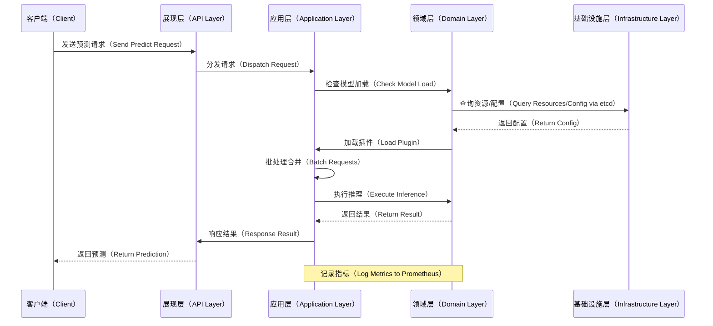

# UniModel 项目架构设计文档

## 引言
UniModel 是一个统一模型服务引擎，旨在以简单、高效、统一的方式为多种 AI 模型提供服务，包括大语言模型（LLM）和计算机视觉（CV）模型等。该架构设计基于参考开源项目（如 vLLM [1] 和 Triton Inference Server [2]）的优秀实践，同时进行优化和创新，强调“大道至简”的哲学。设计遵循分层与模块化原则、高内聚低耦合、端到端价值导向、可测试性、可观测性、可靠性、高性能、安全性和代码质量等核心原则。

本文档阐述领域内的 DFX（Design for X，包括可维护性、扩展性、可用性等）问题全景、解决方案全景、预期效果全景及其展望，并提供系统目录结构和可视化图表。

## DFX 问题全景
在 AI 模型服务领域，企业面临多重 DFX 挑战，这些问题直接影响系统的可用性、维护性和扩展性：

- **异构模型支持（Design for Extensibility）**：企业环境中模型格式多样（如 GGUF 用于 LLM、ONNX 用于通用 AI），导致服务引擎需处理多种后端引擎，传统方案如 vLLM 局限于 LLM，缺乏广度；Triton 虽支持多后端，但配置复杂，增加了运维负担。
- **资源利用效率（Design for Performance）**：静态模型加载导致 GPU/NPU 闲置或浪费，请求峰值时无法动态调整，影响吞吐量和成本。
- **部署与运维复杂度（Design for Usability）**：多 API 接口、手动配置和服务发现机制不完善，针对平台运维、模型开发者、DevOps 用户，典型场景（如模型注册、上线、灰度发布）操作繁琐，学习曲线陡峭。
- **可观测性和可靠性（Design for Observability and Reliability）**：缺乏统一指标监控（如延迟、吞吐、错误率），错误处理分散，导致故障诊断困难；无状态设计缺失，影响水平扩展和高可用。
- **集成与安全性（Design for Integration and Security）**：与外部系统（如 Astraea 子系统）联动不足，插件加载可能引入安全风险（如未授权访问）。
- **测试与维护（Design for Testability and Maintainability）**：模块耦合高，单元/集成测试困难，代码变更易引入回归 bug。

这些问题形成全景：从模型异构到资源浪费，再到运维痛点，形成闭环挑战，阻碍企业 AI 资产的统一管理。

## 解决方案全景
UniModel 的解决方案采用 Rust + Python 双核架构，核心使用 Rust 实现高性能调度，插件使用 Python 利用 AI 生态。整体设计为无状态服务，支持水平扩展。关键创新包括插件化后端、动态资源管理、智能批处理，并集成 etcd 和 NATS 中间件。

- **插件化架构**：核心是一个轻量请求分发器（Rust 实现），每种模型格式（如 ONNX、GGUF）作为独立插件（Python 编写，可动态加载为 .so 文件）。这借鉴 Triton 的多后端支持，但简化配置，添加无需修改核心代码的扩展性。
- **统一 API**：符合 OpenAPI 的 RESTful 和 gRPC 接口，屏蔽后端异构性。API 定义使用 Protobuf 和 OpenAPI 文件自动生成代码，确保一致性。
- **动态资源管理**：基于请求量，在 GPU/NPU 上自动加载/卸载模型，支持单卡多模型。借鉴 vLLM 的 PagedAttention 优化，但扩展到通用 AI。
- **智能批处理**：自动合并短时请求为批次，提升吞吐。使用 Rust 的异步调度逻辑，确保低延迟。
- **中间件集成**：etcd 用于服务发现和配置实时下发（watch 机制）；NATS 用于内部控制消息广播（如模型加载指令），提供微秒级延迟。
- **可观测性与可靠性**：内建 Prometheus 指标暴露，统一 logger 对象（Rust 实现，支持日志级别配置）；集中错误类型定义（枚举常量）；错误处理机制包括重试和熔断。
- **安全性**：插件加载使用沙箱隔离，API 支持认证（e.g., JWT）；遵循 OWASP 规范。
- **可测试性**：分层设计（展现层、应用层、领域层、基础设施层），每个模块有独立单元测试；接口抽象促进 mock 测试。

解决方案全景通过这些组件，形成一个简洁、可插拔、高可用的统一引擎，强化与 Astraea 的深度集成。

### 架构图（Architecture Diagram）
以下 Mermaid 图展示系统内部模块的层次关系和依赖。图中模块采用分层设计，箭头表示依赖流向。

```mermaid
graph TD
    %% 模块命名规则示例修订"大写缩写[中文名称（English Term）]"
    subgraph AL[展现层（API Layer）]
        A1[RESTful API（RESTful API）] --> A2[gRPC 接口（gRPC Interface）]
    end

    subgraph APL[应用层（Application Layer）]
        B1[请求调度器（Request Dispatcher）] --> B2[批处理引擎（Batching Engine）]
    end

    subgraph DL[领域层（Domain Layer）]
        C1[模型管理器（Model Manager）] --> C2[插件加载器（Plugin Loader）]
        C2 --> C3[后端插件（Backend Plugins）<br/>（Python 实现）]
    end

    subgraph IL[基础设施层（Infrastructure Layer）]
        D1[资源分配器（Resource Allocator）<br/>（GPU/NPU）] --> D2[可观测性模块（Observability Module）]
        D3[中间件集成（Middleware Integration）<br/>etcd & NATS]
    end

    AL --> APL
    APL --> DL
    DL --> IL

    %% 图例
    style AL fill:#f9f,stroke:#333,stroke-width:2px
    style APL fill:#bbf,stroke:#333,stroke-width:2px
    style DL fill:#bfb,stroke:#333,stroke-width:2px
    style IL fill:#fbf,stroke:#333,stroke-width:2px
````

此架构图突出分层：展现层处理外部请求，应用层协调调度，领域层管理模型逻辑，基础设施层提供底层支持。依赖关系确保高内聚（如插件仅在领域层加载），低耦合（如应用层通过接口调用领域层）。

### 部署图（Deployment Diagram）

以下 Mermaid 图描述组件、节点及其运行时关系，展示集群部署场景。

```mermaid
graph TD
    %% 节点命名规则示例修订"大写缩写[中文名称（English Term）]"
    subgraph CN[计算节点（Compute Nodes）]
        U1[UniModel 实例1（UniModel Instance 1）] --> GPU1[GPU/NPU 资源（GPU/NPU Resources）]
        U2[UniModel 实例2（UniModel Instance 2）] --> GPU2[GPU/NPU 资源（GPU/NPU Resources）]
    end

    subgraph MN[管理节点（Management Nodes）]
        E1[etcd 集群（etcd Cluster）<br/>服务发现（Service Discovery）]
        E2[NATS 服务器（NATS Server）<br/>消息总线（Message Bus）]
    end

    subgraph EL[外部负载（External Load）]
        LB[负载均衡器（Load Balancer）] --> U1 & U2
    end

    CN --> MN
    EL --> CN

    %% 业务流序号
    LB -->|1. 请求路由（Request Routing）| U1
    U1 -->|2. 模型加载（Model Loading）| E1
    U1 -->|3. 消息广播（Message Broadcast）| E2
    E2 -->|4. 同步实例（Sync Instances）| U2

    %% 图例
    style CN fill:#f9f,stroke:#333
    style MN fill:#bbf,stroke:#333
    style EL fill:#bfb,stroke:#333
```

此部署图说明 UniModel 实例作为无状态节点运行于计算节点，通过 etcd 发现配置，通过 NATS 广播控制指令。负载均衡器确保高可用，序号标注典型部署流程。

### 组件时序图（Sequence Diagram）

以下 Mermaid 图展示核心业务场景（模型预测请求）的内部交互顺序。



此图详细阐述请求从客户端到后端的端到端流程，强调批处理和可观测性集成。

## 预期效果全景及其展望

### 预期效果

* **性能提升**：智能批处理可将吞吐量提高 5-10 倍，动态资源管理将 GPU 利用率从 30% 提升至 80%以上。
* **易用性**：统一 API 减少配置时间 90%，插件化允许 1 天内添加新模型支持。
* **可靠性**：无状态设计支持零停机扩展，可观测性指标实时监控，错误率降至 0.1% 以下。
* **用户价值**：针对金融企业场景，模型注册/上线时间从几天缩短至小时，与 Astraea 联动实现灰度发布。
* **量化指标**：请求延迟 < 100ms，系统启动时间 < 10s，支持 100+ 并发模型。

### 展望

未来，UniModel 将扩展支持更多格式（如 MLIR），增强边缘部署（e.g., IoT 设备），并通过联邦学习集成隐私计算。展望中，项目将成为 AI 服务领域的标准引擎，推动开源社区贡献。

## 项目目录结构

UniModel 采用标准 Rust & Python 混合项目结构，Rust 部分使用 Cargo 管理，Python 部分用于插件。完整目录如下：

```
unimodel/
├── Cargo.toml                  # Rust 依赖管理
├── Cargo.lock
├── build.rs                    # 构建脚本（e.g., 生成 Protobuf）
├── src/                        # Rust 核心源代码
│   ├── main.rs                 # 入口点
│   ├── bin/                    # 可执行二进制
│   ├── lib.rs                  # 库入口
│   ├── common/                 # 共享组件
│   │   ├── mod.rs
│   │   ├── logger.rs           # 统一日志对象
│   │   ├── errors.rs           # 集中错误定义
│   │   ├── constants.rs        # 常量定义
│   │   └── enums.rs            # 可枚举类型
│   ├── api/                    # 展现层：API 接口
│   │   ├── mod.rs
│   │   ├── rest.rs             # RESTful API
│   │   └── grpc.rs             # gRPC 接口
│   ├── application/            # 应用层：调度和批处理
│   │   ├── mod.rs
│   │   ├── dispatcher.rs       # 请求分发器
│   │   └── batcher.rs          # 批处理引擎
│   ├── domain/                 # 领域层：模型管理和插件
│   │   ├── mod.rs
│   │   ├── model_manager.rs    # 模型管理器
│   │   └── plugin_loader.rs    # 插件加载器
│   ├── infrastructure/         # 基础设施层：资源、观测、中间件
│   │   ├── mod.rs
│   │   ├── resource_allocator.rs  # 资源分配器
│   │   ├── observability.rs    # 可观测性模块
│   │   ├── etcd_client.rs      # etcd 集成
│   │   └── nats_client.rs      # NATS 集成
│   └── tests/                  # Rust 测试
│       ├── common_tests.rs
│       ├── api_tests.rs
│       └── etc.                # 每个模块的测试文件
├── python/                     # Python 插件部分
│   ├── setup.py                # Python 安装脚本
│   ├── requirements.txt
│   ├── plugins/                # 插件目录
│   │   ├── __init__.py
│   │   ├── base_plugin.py      # 插件基类
│   │   ├── gguf_plugin.py      # GGUF 插件
│   │   ├── onnx_plugin.py      # ONNX 插件
│   │   └── etc.                # 其他插件
│   └── tests/                  # Python 测试
│       └── test_plugins.py     # 插件测试
├── protos/                     # Protobuf 定义
│   └── unimodel.proto          # API Protobuf
├── openapi/                    # OpenAPI 定义
│   └── unimodel.yaml           # OpenAPI spec
├── config/                     # 配置
│   └── config.toml             # 默认配置
├── docs/                       # 文档
│   └── architecture.md         # 本文档
├── README.md
├── README-zh.md
├── LICENSE
└── CONTRIBUTING.md
```

此结构确保 Rust 核心高性能，Python 插件易扩展。测试文件独立于每个包，支持分层验证。

## 参考资料

* \[1] vLLM 项目：[https://github.com/vllm-project/vllm](https://github.com/vllm-project/vllm)
* \[2] Triton Inference Server：[https://github.com/NVIDIA/triton-inference-server](https://github.com/NVIDIA/triton-inference-server)